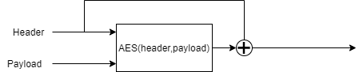

# problems-with-primitives
Examples to show common mistakes with the implementation of cryptographic primitives

# collision_calculator.py

An example to show just how easy it is to construct a collision for poorly constructed hashes. This construction deviates very slightly from Davies-Meyer and XORs the header (chaining variable / key / etc) back onto the output. The example demonstrates just one round of this close cousin of Davies-Meyer, and calculates a datagram which will collide.

Maths:

Given a datagram  given by    and a Hash construction like so:

We can pick a different random header   and calculate a payload such that the combination produces a collision. The following is a formula:

